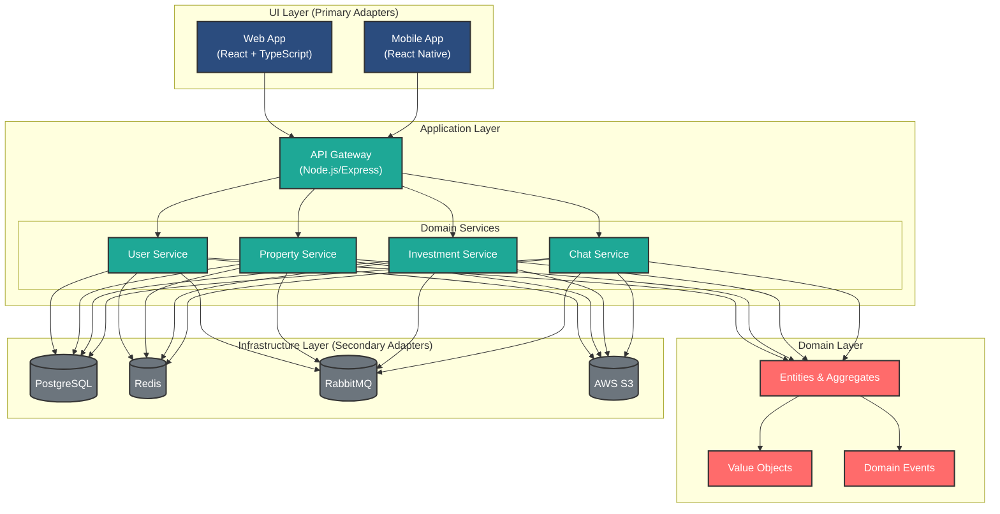
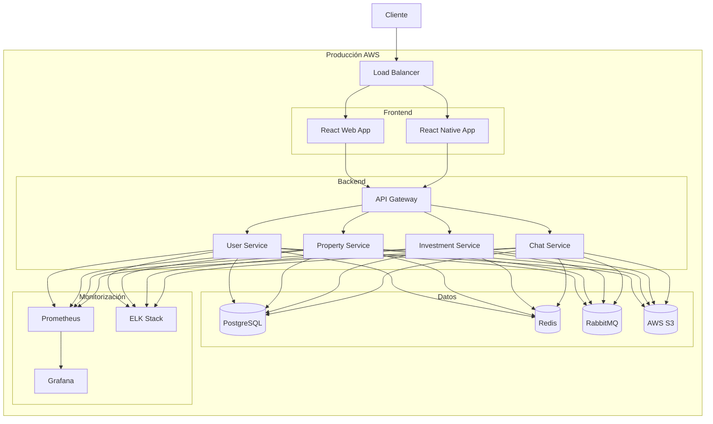
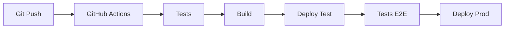
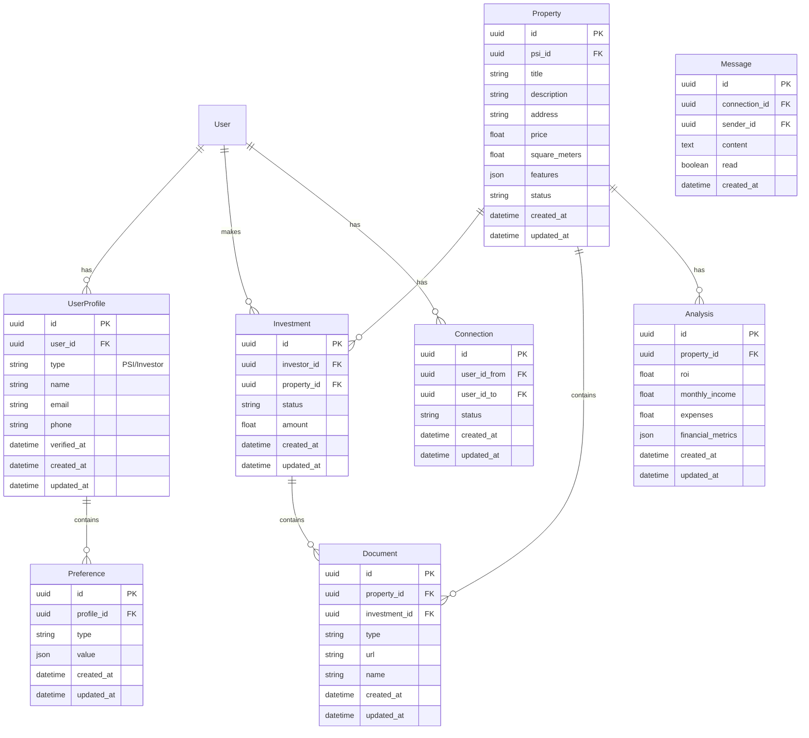

## Índice

0. [Ficha del proyecto](#0-ficha-del-proyecto)
1. [Descripción general del producto](#1-descripción-general-del-producto)
2. [Arquitectura del sistema](#2-arquitectura-del-sistema)
3. [Modelo de datos](#3-modelo-de-datos)
4. [Especificación de la API](#4-especificación-de-la-api)
5. [Historias de usuario](#5-historias-de-usuario)
6. [Tickets de trabajo](#6-tickets-de-trabajo)
7. [Pull requests](#7-pull-requests)

---

## 0. Ficha del proyecto

### **0.1. Tu nombre completo: Roger Martínez Terés**

### **0.2. Nombre del proyecto: InvestHome Pro**

### **0.3. Descripción breve del proyecto:**

Una plataforma que conecta Personal Shoppers Inmobiliarios con inversores, facilitando la gestión y presentación de oportunidades de inversión inmobiliaria previamente analizadas. La plataforma permite crear redes profesionales entre ambos perfiles, agilizando el proceso de inversión y mejorando la toma de decisiones.

### **0.4. URL del proyecto:**

TBD

### 0.5. URL o archivo comprimido del repositorio

TDD

---

## 1. Descripción general del producto

### **1.1. Objetivo:**

InvestHome Pro tiene como objetivo principal revolucionar y optimizar el proceso de inversión inmobiliaria mediante la creación de un ecosistema digital que conecta a Personal Shoppers Inmobiliarios (PSI) con inversores de manera eficiente y profesional.

El producto resuelve tres problemas fundamentales del sector:

1. **Fragmentación del mercado:** Centraliza la conexión entre PSIs cualificados e inversores activos, eliminando intermediarios innecesarios y reduciendo el tiempo de búsqueda de oportunidades.

2. **Ineficiencia operativa:** Automatiza y digitaliza procesos que tradicionalmente son manuales y repetitivos, permitiendo a los PSIs dedicar más tiempo al análisis de oportunidades y menos a tareas administrativas.

3. **Falta de estandarización:** Establece un formato profesional y estructurado para la presentación de oportunidades de inversión, facilitando la toma de decisiones y mejorando la transparencia del proceso.

Los usuarios objetivo son:
- Personal Shoppers Inmobiliarios que buscan expandir su red de inversores y gestionar eficientemente sus operaciones
- Inversores inmobiliarios que buscan acceso a oportunidades pre-analizadas y una red de profesionales verificados
- Agencias inmobiliarias que quieren digitalizar y profesionalizar sus servicios de inversión

### **1.2. Características y funcionalidades principales:**

1. **Sistema de Usuarios y Perfiles**
   - Registro y autenticación diferenciada para PSIs e inversores
   - Verificación de identidad y credenciales profesionales
   - Perfiles profesionales personalizables
   - Sistema de reputación y testimonios verificados
   - Gestión de preferencias y criterios de inversión

2. **Gestión de Red Profesional**
   - Sistema de conexiones PSI-Inversor
   - Búsqueda avanzada de contactos con filtros específicos
   - Gestión de solicitudes de conexión
   - Visualización de red profesional y conexiones en común
   - Sistema de recomendaciones basado en perfil

3. **Gestión de Oportunidades de Inversión**
   - Publicación estructurada de propiedades
   - Sistema estandarizado de análisis financiero
   - Calculadora de rentabilidad integrada
   - Gestión de documentación y due diligence
   - Sistema de estados y seguimiento de oportunidades

4. **Comunicación y Seguimiento**
   - Chat profesional integrado
   - Sistema de notificaciones personalizable
   - Agenda de visitas y reuniones
   - Historial de interacciones
   - Compartición segura de documentos

5. **Analytics y Reporting**
   - Dashboard personalizado por tipo de usuario
   - Métricas de rendimiento de oportunidades
   - Análisis de mercado y tendencias
   - Informes de actividad y conversión
   - Exportación de datos y reportes

6. **Herramientas de Productividad**
   - Templates de análisis financiero
   - Generación automática de informes
   - Comparador de oportunidades
   - Sistema de etiquetado y organización
   - Integración con herramientas externas (CRM, calendarios)

7. **Seguridad y Cumplimiento**
   - Encriptación de datos sensibles
   - Gestión de permisos y accesos
   - Trazabilidad de operaciones
   - Cumplimiento GDPR/LOPD
   - Backup automático de información

### **1.3. Diseño y experiencia de usuario:**

#### 1.3.1. Flujos principales de usuario

**1. Flujo del Personal Shopper Inmobiliario (PSI)**
- Registro y verificación profesional
- Configuración del perfil profesional
- Publicación de oportunidades de inversión
- Gestión de red de inversores
- Seguimiento de propuestas

**2. Flujo del Inversor**
- Registro y verificación
- Configuración de preferencias de inversión
- Exploración de oportunidades
- Conexión con PSIs
- Seguimiento de inversiones

#### 1.3.2. Wireframes principales

**Landing Page**

TBD

#### 1.3.3. Paleta de colores y diseño

**Colores principales:**
- Primary: #2B4C7E (Azul corporativo - Transmite profesionalidad y confianza)
- Secondary: #1EA896 (Verde-azulado - Representa crecimiento y estabilidad)
- Accent: #FF6B6B (Coral - Para llamadas a la acción)
- Neutral: #F8F9FA (Fondo claro para mejor legibilidad)

**Tipografía:**
- Títulos: Poppins (Sans-serif moderna y profesional)
- Cuerpo: Inter (Excelente legibilidad en pantalla)

#### 1.3.4. Principios de diseño

1. **Simplicidad y claridad**
   - Interfaces limpias y organizadas
   - Jerarquía visual clara
   - Información relevante a primera vista

2. **Profesionalidad**
   - Diseño sobrio y corporativo
   - Énfasis en datos y análisis
   - Presentación estructurada de información

3. **Usabilidad**
   - Navegación intuitiva
   - Acciones principales siempre visibles
   - Feedback claro al usuario

4. **Responsive y adaptativo**
   - Diseño mobile-first
   - Adaptación a diferentes dispositivos
   - Mantenimiento de funcionalidad en todas las pantallas

### **1.4. Instrucciones de instalación:**

TBD

---

## 2. Arquitectura del Sistema

### **2.1. Diagrama de arquitectura:**

La arquitectura sigue un diseño hexagonal (ports & adapters) con Domain-Driven Design, estructurada en las siguientes capas:

1. **UI Layer (Adapters primarios)**
   - Aplicación Web (React + TypeScript)
   - Aplicación Móvil (React Native)

2. **Application Layer**
   - API Gateway (Node.js/Express)
   - Servicios de dominio independientes
   - Implementación de casos de uso

3. **Domain Layer**
   - Entidades y agregados
   - Reglas de negocio
   - Value Objects
   - Domain Events

4. **Infrastructure Layer (Adapters secundarios)**
   - Persistencia (PostgreSQL)
   - Cache (Redis)
   - Message Queue (RabbitMQ)
   - File Storage (S3)

**Beneficios de esta arquitectura:**
- Separación clara de responsabilidades
- Testabilidad mejorada
- Escalabilidad independiente de servicios
- Mantenibilidad a largo plazo

**Sacrificios/Compromisos:**
- Mayor complejidad inicial
- Overhead en comunicación entre servicios
- Necesidad de gestionar consistencia eventual



### **2.2. Descripción de componentes principales:**

#### Capa de UI (Adaptadores Primarios)

1. **Aplicación Web (React + TypeScript)**
   - Framework: React 18
   - Gestión de Estado: Redux Toolkit
   - Componentes UI: Material-UI v5
   - Gestión de Formularios: React Hook Form
   - Cliente API: Axios
   - Pruebas: Jest + React Testing Library
   - Herramienta de Construcción: Vite

2. **Aplicación Móvil (React Native)**
   - Framework: React Native
   - Navegación: React Navigation 6
   - Gestión de Estado: Redux Toolkit
   - Componentes UI: React Native Paper
   - Pruebas: Jest + React Native Testing Library

#### Capa de Aplicación

1. **Puerta de Enlace API (Node.js/Express)**
   - Entorno de Ejecución: Node.js 20.x
   - Framework: Express.js
   - Documentación API: OpenAPI/Swagger
   - Autenticación: JWT + OAuth2
   - Validación: Joi/Zod
   - Pruebas: Jest + Supertest

2. **Servicios de Dominio**
   - **Servicio de Usuarios**
     - Gestión de usuarios y perfiles
     - Sistema de autenticación y autorización
     - Gestión de preferencias
     
   - **Servicio de Propiedades**
     - Gestión de propiedades
     - Sistema de búsqueda y filtrado
     - Análisis financiero
     
   - **Servicio de Inversiones**
     - Gestión de oportunidades de inversión
     - Sistema de seguimiento
     - Análisis de rentabilidad
     
   - **Servicio de Chat**
     - Comunicación en tiempo real
     - Gestión de mensajes y notificaciones
     - WebSocket con Socket.io

#### Capa de Dominio

1. **Entidades y Agregados**
   - Implementación de lógica de negocio
   - Invariantes y reglas de dominio
   - Patrones DDD (Entidad, Raíz de Agregado, Objeto de Valor)

2. **Eventos de Dominio**
   - Origen de Eventos
   - Almacén de Eventos
   - Manejadores de Eventos

#### Capa de Infraestructura (Adaptadores Secundarios)

1. **Base de Datos PostgreSQL**
   - ORM: Prisma
   - Migraciones automáticas
   - Índices y optimizaciones
   - Copias de seguridad y recuperación

2. **Caché Redis**
   - Caché de sesión
   - Limitación de tasa
   - Colas de trabajo
   - Publicación/Suscripción para tiempo real

3. **Cola de Mensajes RabbitMQ**
   - Gestión de eventos de dominio
   - Comunicación asíncrona entre servicios
   - Patrones de mensajería (Publicador/Suscriptor, Solicitud/Respuesta)

4. **Almacenamiento AWS S3**
   - Almacenamiento de documentos
   - Red de distribución de contenidos para imágenes
   - Copias de seguridad de datos
   - Gestión de versiones

#### Herramientas de Desarrollo y Despliegue

1. **Control de Versiones**
   - Git + GitHub
   - Commits Convencionales
   - Acciones de GitHub para CI/CD

2. **Monitorización y Registro**
   - Pila ELK
   - Prometheus + Grafana
   - Sentry para seguimiento de errores

3. **Pruebas**
   - TDD con Jest
   - Pruebas E2E con Cypress
   - Pruebas de carga con k6
   - SonarQube para calidad de código

### **2.3. Descripción de alto nivel del proyecto y estructura de ficheros**

La estructura del proyecto sigue una arquitectura hexagonal (ports & adapters) con DDD, organizada de la siguiente manera:

```
src/
├── application/                # Casos de uso y servicios de aplicación
│   ├── services/              # Servicios de aplicación
│   │   ├── user/             # Servicios relacionados con usuarios
│   │   ├── property/         # Servicios de gestión de propiedades
│   │   ├── investment/       # Servicios de inversión
│   │   └── chat/            # Servicios de comunicación
│   ├── ports/                 # Puertos (interfaces) de entrada y salida
│   │   ├── input/           # Puertos de entrada (API, UI)
│   │   └── output/          # Puertos de salida (DB, servicios externos)
│   └── use-cases/             # Casos de uso específicos
│       ├── user/
│       ├── property/
│       └── investment/
│
├── domain/                    # Núcleo de dominio
│   ├── entities/              # Entidades de dominio
│   │   ├── user/
│   │   ├── property/
│   │   └── investment/
│   ├── value-objects/         # Objetos de valor
│   ├── aggregates/            # Agregados
│   ├── events/                # Eventos de dominio
│   └── repositories/          # Interfaces de repositorio
│
├── infrastructure/            # Adaptadores e implementaciones
│   ├── persistence/           # Implementaciones de persistencia
│   │   ├── postgresql/        # Adaptador PostgreSQL
│   │   │   ├── repositories/
│   │   │   ├── models/
│   │   │   └── migrations/
│   │   └── redis/            # Adaptador Redis
│   │       ├── cache/
│   │       └── session/
│   ├── messaging/             # Implementación de mensajería
│   │   └── rabbitmq/         # Adaptador RabbitMQ
│   │       ├── publishers/
│   │       └── consumers/
│   ├── storage/              # Implementación de almacenamiento
│   │   └── s3/               # Adaptador AWS S3
│   └── api/                  # Implementación de API
│       └── express/          # Adaptador Express
│           ├── routes/
│           ├── middlewares/
│           └── controllers/
│
├── ui/                       # Interfaces de usuario
│   ├── web/                  # Aplicación web React
│   │   ├── components/
│   │   ├── pages/
│   │   ├── hooks/
│   │   └── store/
│   └── mobile/               # Aplicación móvil React Native
│       ├── components/
│       ├── screens/
│       ├── navigation/
│       └── store/
│
└── shared/                   # Código compartido
    ├── types/                # Tipos y interfaces
    ├── utils/                # Utilidades comunes
    └── constants/            # Constantes globales
```

#### Principios de Organización:

1. **Separación de Capas**
   - Cada capa tiene su propia responsabilidad bien definida
   - Las dependencias fluyen unidireccionalmente hacia el dominio
   - Se aplica inversión de dependencias mediante interfaces
   - Clara separación entre lógica de negocio y detalles técnicos

2. **Modularidad**
   - Módulos independientes y cohesivos
   - Bajo acoplamiento entre módulos
   - Reutilización de código mediante carpeta shared
   - Cada módulo puede evolucionar de forma independiente

3. **Escalabilidad**
   - Estructura preparada para el crecimiento del proyecto
   - Fácil adición de nuevos adaptadores y funcionalidades
   - Separación clara de responsabilidades
   - Posibilidad de escalar servicios de forma independiente

4. **Mantenibilidad**
   - Organización intuitiva y consistente
   - Fácil localización de componentes y funcionalidades
   - Estructura preparada para pruebas unitarias por capa
   - Documentación integrada en la estructura

#### Convenciones de Nombrado:

1. **Archivos**
   - Entidades: `[nombre].entity.ts`
   - Repositorios: `[nombre].repository.ts`
   - Servicios: `[nombre].service.ts`
   - Controladores: `[nombre].controller.ts`
   - Tests: `[nombre].spec.ts`

2. **Directorios**
   - Módulos en singular: `user/` en lugar de `users/`
   - Descriptivos y específicos: `persistence/` en lugar de `data/`
   - Agrupación

### **2.4. Infraestructura y despliegue**

#### 2.4.1 Diagrama de Infraestructura



#### 2.4.2 Componentes Principales

1. **Frontend**
   - Web App: Desplegada en AWS S3 + CloudFront
   - Mobile App: Distribuida vía App Stores

2. **Backend**
   - API Gateway: AWS ECS en contenedores
   - Microservicios: AWS ECS Fargate
   - Base de Datos: AWS RDS PostgreSQL
   - Caché: AWS ElastiCache Redis
   - Cola de Mensajes: Amazon MQ (RabbitMQ)
   - Almacenamiento: AWS S3

3. **Monitorización**
   - Métricas: Prometheus + Grafana
   - Logs: ELK Stack
   - Alertas: AWS CloudWatch

#### 2.4.3 Proceso de Despliegue

1. **Pipeline de CI/CD**


2. **Fases del Despliegue**
   - **Desarrollo**
     1. Pruebas locales con Docker Compose
     2. Commit y push a GitHub
     3. Ejecución de pipeline CI/CD

   - **Pruebas**
     1. Despliegue automático en entorno de pruebas
     2. Ejecución de tests E2E
     3. Validación de rendimiento

   - **Producción**
     1. Aprobación manual requerida
     2. Despliegue Blue-Green
     3. Verificación de salud
     4. Rollback automático si es necesario

3. **Estrategias de Despliegue**
   - Zero-downtime deployments
   - Canary releases para cambios críticos
   - Rollback automatizado
   - Monitorización post-despliegue

#### 2.4.4 Seguridad y Backup

1. **Seguridad**
   - WAF en frontal
   - VPC con subredes privadas
   - Certificados SSL/TLS
   - Secrets en AWS Secrets Manager

2. **Backup**
   - Snapshots diarios de RDS
   - Replicación cross-region
   - Retención de 30 días
   - Pruebas de recuperación mensuales

#### 2.4.5 Escalabilidad

1. **Horizontal**
   - Auto-scaling para servicios
   - Múltiples zonas de disponibilidad
   - Balanceo de carga automático

2. **Vertical**
   - Monitorización de recursos
   - Ajuste automático de capacidad
   - Alertas de rendimiento

---

## 3. Modelo de Datos

### **3.1. Diagrama del modelo de datos:**



### **3.2. Descripción de entidades principales:**

#### User y UserProfile
- **User**: Entidad base para autenticación
- **UserProfile**: Información detallada del usuario
  - Tipos: PSI (Personal Shopper Inmobiliario) o Inversor
  - Verificación requerida para PSIs
  - Preferencias personalizables

#### Property
- Propiedades inmobiliarias
- Gestionadas por PSIs
- Incluye detalles básicos y características
- Estados: borrador, publicada, reservada, vendida
- Análisis financiero asociado

#### Investment
- Representa interés o inversión en una propiedad
- Estados: interesado, en_proceso, completada, cancelada
- Documentación asociada
- Trazabilidad completa

#### Connection
- Relaciones entre PSIs e Inversores
- Estados: pendiente, aceptada, rechazada
- Base para el sistema de mensajería
- Historial de interacciones

#### Analysis
- Análisis financiero de propiedades
- Métricas de rentabilidad
- Proyecciones financieras
- Datos para toma de decisiones

#### Document
- Sistema de gestión documental
- Tipos: contratos, informes, análisis
- Almacenamiento seguro en S3
- Control de versiones

#### Preference
- Preferencias de usuario
- Configuración de notificaciones
- Criterios de inversión
- Personalización de experiencia

### **3.3. Índices y Optimizaciones:**

1. **Índices Principales**
   - `user_profiles_user_id_idx`
   - `properties_psi_id_status_idx`
   - `investments_investor_id_status_idx`
   - `connections_user_ids_idx`

2. **Constraints**
   - Claves foráneas con eliminación en cascada
   - Restricciones unique en emails
   - Checks en estados y tipos

3. **Particionamiento**
   - Mensajes por fecha
   - Documentos por tipo
   - Properties por estado

---

## 4. Especificación de la API

### 4.1. Especificación OpenAPI de endpoints principales

```yaml
openapi: 3.0.0
info:
  title: InvestHome Pro API
  version: 1.0.0
  description: API para la gestión de inversiones inmobiliarias

paths:
  /api/v1/properties:
    post:
      summary: Crear nueva oportunidad de inversión
      tags:
        - Properties
      security:
        - bearerAuth: []
      requestBody:
        required: true
        content:
          application/json:
            schema:
              type: object
              required:
                - title
                - description
                - price
                - location
                - analysis
              properties:
                title:
                  type: string
                  example: "Apartamento en zona prime"
                description:
                  type: string
                price:
                  type: number
                  format: float
                location:
                  type: object
                  properties:
                    address:
                      type: string
                    city:
                      type: string
                    coordinates:
                      type: object
                      properties:
                        lat:
                          type: number
                        lng:
                          type: number
                analysis:
                  type: object
                  properties:
                    roi:
                      type: number
                    monthlyIncome:
                      type: number
                    expenses:
                      type: number
      responses:
        '201':
          description: Propiedad creada exitosamente
          content:
            application/json:
              schema:
                $ref: '#/components/schemas/Property'
        '400':
          description: Datos inválidos
        '401':
          description: No autorizado

  /api/v1/investments/{propertyId}:
    post:
      summary: Registrar interés en una propiedad
      tags:
        - Investments
      security:
        - bearerAuth: []
      parameters:
        - in: path
          name: propertyId
          required: true
          schema:
            type: string
            format: uuid
      requestBody:
        required: true
        content:
          application/json:
            schema:
              type: object
              required:
                - type
                - message
              properties:
                type:
                  type: string
                  enum: [interest, offer]
                message:
                  type: string
                amount:
                  type: number
      responses:
        '201':
          description: Interés registrado exitosamente
          content:
            application/json:
              schema:
                $ref: '#/components/schemas/Investment'
        '404':
          description: Propiedad no encontrada
        '401':
          description: No autorizado

  /api/v1/connections/{userId}:
    post:
      summary: Establecer conexión con otro usuario
      tags:
        - Connections
      security:
        - bearerAuth: []
      parameters:
        - in: path
          name: userId
          required: true
          schema:
            type: string
            format: uuid
      requestBody:
        required: true
        content:
          application/json:
            schema:
              type: object
              required:
                - message
              properties:
                message:
                  type: string
      responses:
        '201':
          description: Solicitud de conexión enviada
          content:
            application/json:
              schema:
                $ref: '#/components/schemas/Connection'
        '400':
          description: Usuario no válido
        '401':
          description: No autorizado

components:
  schemas:
    Property:
      type: object
      properties:
        id:
          type: string
          format: uuid
        title:
          type: string
        description:
          type: string
        price:
          type: number
        status:
          type: string
          enum: [draft, published, reserved, sold]
        createdAt:
          type: string
          format: date-time

    Investment:
      type: object
      properties:
        id:
          type: string
          format: uuid
        propertyId:
          type: string
          format: uuid
        investorId:
          type: string
          format: uuid
        status:
          type: string
          enum: [interested, in_process, completed, cancelled]
        createdAt:
          type: string
          format: date-time

    Connection:
      type: object
      properties:
        id:
          type: string
          format: uuid
        fromUserId:
          type: string
          format: uuid
        toUserId:
          type: string
          format: uuid
        status:
          type: string
          enum: [pending, accepted, rejected]
        createdAt:
          type: string
          format: date-time

  securitySchemes:
    bearerAuth:
      type: http
      scheme: bearer
      bearerFormat: JWT
```

### 4.2. Ejemplos de Peticiones y Respuestas

#### Crear Propiedad
**Request:**
```json
POST /api/v1/properties
{
  "title": "Apartamento en zona prime",
  "description": "Excelente oportunidad de inversión...",
  "price": 250000,
  "location": {
    "address": "Calle Principal 123",
    "city": "Barcelona",
    "coordinates": {
      "lat": 41.3851,
      "lng": 2.1734
    }
  },
  "analysis": {
    "roi": 7.5,
    "monthlyIncome": 1200,
    "expenses": 200
  }
}
```

**Response:**
```json
{
  "id": "123e4567-e89b-12d3-a456-426614174000",
  "title": "Apartamento en zona prime",
  "status": "draft",
  "createdAt": "2024-01-20T15:30:00Z",
  "price": 250000,
  "location": {
    "address": "Calle Principal 123",
    "city": "Barcelona",
    "coordinates": {
      "lat": 41.3851,
      "lng": 2.1734
    }
  },
  "analysis": {
    "roi": 7.5,
    "monthlyIncome": 1200,
    "expenses": 200
  }
}
```

---

## 5. Historias de Usuario

### Historia de Usuario #1: Listado de Inversiones

**Como** Inversor
**Quiero** poder ver el listado de mis inversiones
**Para** hacer seguimiento de mi portafolio

#### Criterios de Aceptación
1. Puedo ver un listado de mis inversiones con:
   - Título de la propiedad
   - Monto invertido formateado (€)
   - Estado actual con código de colores
   - Fecha de creación en formato local
   - Nombre del PSI asignado

2. Los estados posibles son:
   - INTERESTED (amarillo)
   - IN_PROCESS (verde)
   - COMPLETED (verde)
   - CANCELLED (rojo)

#### Implementación Técnica
- Componente InvestmentCard para mostrar cada inversión
- Tests con React Testing Library
- Entidad Investment con reglas de dominio
- Cobertura de tests > 90%

### Historia de Usuario #2: Listado de Propiedades

**Como** Inversor
**Quiero** explorar las propiedades disponibles
**Para** encontrar oportunidades de inversión que se ajusten a mis criterios

#### Criterios de Aceptación
1. Visualización de propiedades con:
   - Título descriptivo
   - Precio formateado en euros
   - Metros cuadrados
   - Información del PSI
   - Estado de la propiedad
   - Botón de inversión cuando corresponda

2. Estados posibles:
   - PUBLISHED (verde)
   - RESERVED (amarillo)
   - SOLD (rojo)
   - DRAFT (gris)

### Historia de Usuario #3: Crear Inversión

**Como** Inversor
**Quiero** poder iniciar una inversión en una propiedad
**Para** manifestar mi interés y comenzar el proceso

#### Criterios de Aceptación
1. Formulario de inversión con:
   - Monto a invertir
   - Notas o comentarios
   - Confirmación de términos

2. Validaciones:
   - Monto mínimo requerido
   - Propiedad disponible
   - Usuario verificado

## 6. Tickets de Trabajo

### Ticket #1: Backend - Implementación del Caso de Uso de Inversión

**Tipo:** Feature  
**Componente:** Backend/PropertyService  
**Prioridad:** Alta  
**Estimación:** 8 puntos  
**Referencias:** Historia de Usuario #1

#### Descripción
Implementar el servicio de dominio para la publicación de oportunidades de inversión, siguiendo la arquitectura hexagonal y principios DDD.

#### Requisitos Técnicos
- Implementar en TypeScript
- Seguir arquitectura hexagonal (ver estructura en readme.md líneas 369-431)
- Tests unitarios con Jest
- Documentación OpenAPI

#### Tareas
1. **Implementar Entidad y Value Objects**
   - Crear entidad Property con sus Value Objects correspondientes
   - Implementar validaciones de dominio
   - Definir eventos de dominio relacionados

2. **Crear Puerto del Repositorio**
   - Definir interfaz del repositorio
   - Implementar métodos CRUD básicos
   - Añadir métodos específicos del dominio

3. **Implementar Caso de Uso**
   - Crear caso de uso de creación de propiedad
   - Implementar validaciones de negocio
   - Gestionar eventos de dominio

#### Criterios de Aceptación
1. La propiedad se crea correctamente en la base de datos
2. Se publican los eventos de dominio correspondientes
3. Se validan todos los campos obligatorios
4. Cobertura de tests > 90%

### Ticket #2: Frontend - Implementación del Listado de Propiedades

**Tipo:** Feature  
**Componente:** Frontend/Web  
**Prioridad:** Alta  
**Estimación:** 3 puntos  

#### Descripción
Implementar el listado de propiedades disponibles con filtros y ordenación.

#### Requisitos Técnicos
- React con TypeScript
- React Query para fetching
- Tests con React Testing Library

#### Tareas
1. **Crear Componentes**
   - PropertyList container
   - PropertyCard presentacional
   - PropertyFilters para búsqueda

2. **Implementar Fetching**
   - Setup de React Query
   - Manejo de estados de carga
   - Gestión de errores
   - Paginación infinita

3. **Implementar Tests**
   - Tests unitarios
   - Tests de integración
   - Tests de casos de error

### Ticket #3: Frontend - Implementación del Formulario de Inversión

**Tipo:** Feature  
**Componente:** Frontend/Web  
**Prioridad:** Alta  
**Estimación:** 5 puntos  

#### Descripción
Implementar el formulario modal para crear una nueva inversión.

#### Requisitos Técnicos
- React Hook Form
- Zod para validaciones
- Tests E2E con Cypress

#### Tareas
1. **Crear Componentes**
   - Modal de inversión
   - Formulario con validaciones
   - Confirmación de éxito

2. **Implementar Validaciones**
   - Schema de validación con Zod
   - Validaciones en tiempo real
   - Mensajes de error claros

3. **Tests E2E**
   - Flujo completo de inversión
   - Casos de error
   - Validaciones de campos

---

## 7. Pull Requests

> Documenta 3 de las Pull Requests realizadas durante la ejecución del proyecto

**Pull Request 1**

https://github.com/rogermarte/AI4Devs-finalproject/pull/1

# PR: Implementación Esquema Base de Datos

## 🎯 Resumen
Implementación del esquema de base de datos usando Prisma ORM, incluyendo modelos principales (User, Property, Investment), migraciones y datos de prueba.

## 📝 Cambios Principales

- Esquema Prisma con todas las entidades y relaciones
- Scripts de migración y seeds
- Índices optimizados para consultas frecuentes
- Cliente Prisma configurado
- Scripts de utilidad para gestión de BD

## ✅ Checklist

- [ ] Prisma ORM configurado
- [ ] Esquema Prisma con todas las entidades y relaciones
- [ ] Scripts de migración y seeds
- [ ] Índices optimizados para consultas frecuentes
- [ ] Cliente Prisma configurado
- [ ] Scripts de utilidad para gestión de BD

## 🧪 Testing
```bash
npm run db:migrate
npm run db:seed
npm run verify:seed
```


**Pull Request 2**

**Pull Request 3**

